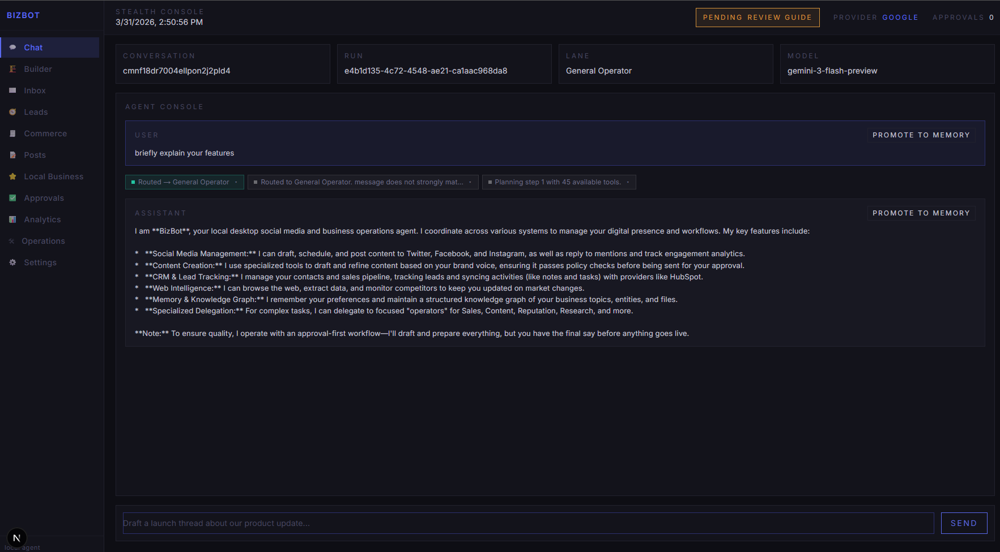
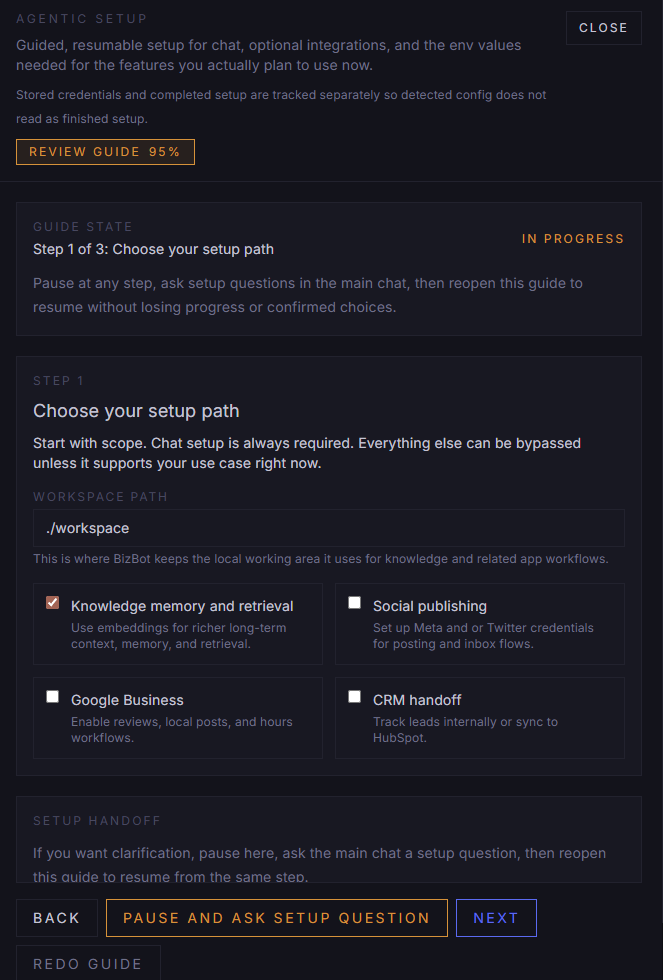

# BizBot

BizBot is a local-first agent orchestration platform: a desktop-native control plane for running specialist agents through typed lanes, deterministic tools, durable run state, and inspectable MCP surfaces.

It is designed more like an agent OS than a single-purpose app. BizBot combines routing, delegation, approvals, memory, ontology, builder workflows, and runtime debugging with a plugin-first development environment for shipping new capabilities safely. Several experimental plugins and plugin-authoring loops are already built in, and the platform is structured to keep expanding through that system instead of collapsing back into one giant prompt and one giant runtime file.





See `CHANGELOG.md` for short rollout notes tied to shipped changes.

## Current Product State

BizBot is no longer just a social posting bot. The app now includes:

- Agent chat with typed specialist routing and tool traces
- A core transient Sidecar panel for rich read-only output outside the main chat
- Chat history controls for recent, archived, restore, and delete flows
- Prompt-aware chat context assembly with rolling conversation summaries, retrieval gating, and token-usage journaling
- Three knowledge lanes: semantic recall, explicit relational user memory, and a core ontology layer for canonical typed entities and relations
- Builder Mode for sandboxed project scaffolding, persistent task orchestration, and external build-workspace execution
- Unified inbox and lead pipeline
- CRM cockpit with notes, tasks, contact sync, and provider status
- Commerce workspace with local products and orders
- Local Business workspace for Google Business Profile reviews, posts, and hours
- Approvals queue and publishing workflows
- Dedicated plugin catalog for builtin toggles and external MCP integration management
- Off-by-default Oracle builtin plugin for read-only multi-market prediction analysis over Polymarket and Kalshi, plus optional Sidecar-enhanced market inspection flows
- Analytics, runtime Operations telemetry, and a settings-linked usage ledger for daily token accounting and cost estimates
- MCP server and MCP client plumbing for tool exposure and imports
- A high-trust MCP plugin design loop for inspection, validation, preview, and contract-impact testing

The current dashboard surface is:

- `/chat`
- `/builder`
- `/inbox`
- `/leads`
- `/commerce`
- `/posts`
- `/local-business`
- `/approvals`
- `/analytics`
- `/operations`
- `/plugins`
- `/settings`

The legacy `/google-business` route still exists as a compatibility redirect to `/local-business`.

## What BizBot Does

- Monitors inbox traffic across Facebook, Instagram, and Twitter/X
- Drafts and sends replies through a bounded agent runtime
- Routes requests into specialist business lanes instead of one generic agent prompt
- Keeps lead stage, lead score, lead summary, and canned-response progression visible in the dashboard
- Stores local-first CRM contacts and activities with optional HubSpot sync
- Stores local-first products and orders for sales and content workflows
- Publishes, schedules, and approves social posts
- Syncs Google Business Profile reviews and posts, drafts replies, and updates business hours
- Exposes a runtime operations surface for jobs, failures, and control-plane state
- Exposes a plugin catalog for enabling builtin plugins and managing external MCP integrations
- Tracks daily token usage, request counts, and model-based cost estimates in Settings, plus live per-conversation usage and cost estimates in Chat
- Opens validated markdown, code, JSON, and image content in a BizBot-owned Sidecar surface through core `sidecar_*` tools
- Supports a read-only Oracle workflow that parses prediction targets, searches Polymarket and Kalshi, blends aligned or divergent market evidence, and returns plain chat predictions with optional Sidecar-driven inspection flows when the builtin Oracle plugin is enabled
- Runs as an MCP server for VS Code and other MCP clients
- Imports external MCP servers through configured client connections
- Creates and manages external builder projects without letting scaffolding work mutate the BizBot repo itself
- Keeps graph-style canonical context separate from semantic memory, explicit user memory, and developer inspection catalogs

## Ontology Core v1

BizBot now ships a core ontology layer for canonical typed entities and relations.

- Postgres is the canonical ontology store through `OntologyEntity`, `OntologyRelation`, `OntologyAlias`, and `OntologyEvidence`.
- Ontology promotion is deterministic and derives only from allowlisted explicit user memory facts such as identity, preference, workflow, constraint, and operator setting.
- Runtime can inject a small fail-soft `[Ontology Context]` block without mixing in developer diagnostics or inspection metadata.
- Developer inspection follows the existing MCP patterns through `bizbot://ontology/*` resources and narrow `developer_*` ontology tools.
- Ontology stays separate from semantic recall, explicit user memory CRUD, and plugin-owned storage.

See `docs/ontology.md` for scope, precedence, ambiguity behavior, lifecycle policy, promotion rules, and governance expectations.

## Developer Workflow

BizBot is set up so feature work can move through a plugin-shaped path instead of forcing developers to keep editing one central runtime file.

### Why This Matters

- New feature surfaces can be modeled as plugins with explicit metadata and dedicated tools.
- Tool contracts are easier to review because schemas, descriptions, and ownership stay close together.
- Runtime exposure stays predictable through the plugin registry instead of ad hoc imports.
- MCP contract tests catch drift in the OSS-facing tool, prompt, and resource surface before it leaks into integrations.
- Power users can inspect exactly how plugin changes alter tools, prompts, resources, and imported MCP provenance before shipping.

### Dev Tools For Feature Work

- `npm run plugin:new -- <plugin-name>` scaffolds a starter plugin file and a matching test file.
- `developer_*` tools expose plugin inspection, contract validation, naming checks, test suggestions, prompt/resource previews, and MCP catalog impact reports.
- `bizbot://plugins/*` resources expose registry reports, naming rules, authoring checklists, and MCP surface previews for plugin authors.
- Builder Mode adds a second path for feature work: create a project in `/builder`, bootstrap a preset, then iterate in a dedicated external workspace instead of inside the BizBot repo.
- `src/lib/agent/plugins/contracts.ts` defines the formal BizBot plugin contract used by builtin and future external-style plugins.
- `src/lib/agent/plugins/registry.ts` centralizes plugin registration, duplicate detection, and tool-to-plugin ownership mapping.
- `src/lib/builder/*` contains the Builder Mode runtime for project records, presets, typed commands, CLI adapters, and workspace safety rules.
- `tests/plugins/*` gives you fixture-oriented coverage for registry rules, provider-style tools, and builtin runtime seams.
- `tests/builder/*` covers builder config, project lifecycle, and route behavior so scaffolding and CLI orchestration stay predictable.
- `tests/mcp/*` verifies the public MCP surface so plugin changes do not silently break tools, prompts, resources, or transport behavior.
- `tests/e2e/*` holds coarse Playwright browser flows that exercise real user paths with stable test hooks instead of brittle layout coupling.
- `npm run test:mcp` isolates MCP and plugin coverage from the rest of the app.
- `npm run test:e2e` runs the Playwright browser suite, including the explicit Oracle chat flow against a managed local dev server.
- `npm run lint:docs` keeps README and contributor docs aligned with the actual developer workflow.

### Building Features As Plugins

The intended feature path is:

1. Scaffold a plugin with `npm run plugin:new -- <plugin-name>`.
2. Define metadata and narrow tool contracts in the plugin file.
3. Register the plugin in the builtin registry if it ships with BizBot.
4. Add fixture-based tests for execution shape, defaults, and failure cases.
5. If the feature is MCP-visible, update or verify MCP contract coverage.

That gives a developer one repeatable path from idea to shipped feature: scaffold, define schema, register, test, expose.

### MCP Plugin Design Lab

BizBot's MCP surface is intentionally broad and optimized for advanced users, not novice-safe guardrails.

- Use `developer_plan_plugin` to turn a plugin goal into a suggested boundary and starter tool set.
- Use `developer_check_tool_naming`, `developer_validate_plugin_contract`, and `developer_inspect_plugin_registry` before relying on a new namespace.
- Use `developer_preview_tool_descriptor`, `developer_preview_prompt`, and `developer_preview_resource` to inspect the MCP-facing surface without digging through the codebase manually.
- Use `developer_check_mcp_contract_impact` and `developer_suggest_plugin_tests` before updating builtin registry wiring or MCP snapshots.
- Use `bizbot://plugins/registry-report`, `bizbot://plugins/mcp-surface-preview`, and `bizbot://plugins/contracts-status` when you want the current control-plane state as structured JSON.

## Builder Mode

Builder Mode is BizBot's safe build lane for generating new projects, plugin packages, and one-off app scaffolds outside the main repository.

### Why Builder Mode Exists

- It gives BizBot a place to help build new things without granting file-write power over the BizBot repo.
- It separates product-development scaffolding from the app's own source tree.
- It keeps codegen and CLI orchestration typed, testable, lane-gated, and MCP-exposed.

### Current Builder Behavior

- `/builder` is a dedicated dashboard surface for project creation, bootstrap actions, task requests, run history, current plan, and latest review state.
- Builder projects are persisted with templates, package manager choice, run records, durable project context, persistent Builder tasks, and structured reviews.
- The builder workspace must live outside the BizBot repository; overlap fails closed.
- Raw command execution is allowlisted through `BIZBOT_BUILDER_ALLOWED_COMMANDS` and remains bounded to the external Builder workspace.
- Presets currently cover `node-cli`, `vite-app`, `next-app`, and `plugin-package`.
- The preferred orchestration path is the native in-process Builder loop, which runs project-scoped work through the `builder_operator` lane and deterministic verification.
- Verification installs project dependencies on first run when needed, then executes the smallest deterministic scripts available in `build`, `test`, `lint` order.
- The Builder dashboard now exposes project-scoped stats, per-task history, resume-from-iteration flows, and quick log focus controls.
- Builder health panels now apply threshold-based highlighting so high retry rate, low verification pass rate, blocked promotion flow, and stale ADR pressure stand out without reading every raw metric.
- Desktop packaging includes Builder shortcuts for retry-last-failed-task, open-current-task-logs, and cancel-running-task.
- Low-level Builder commands and optional CLI adapters still exist for bounded operations, but persistent task orchestration is now the default path.
- Claude Code is modeled as a future adapter slot under the same Builder Mode shell, not as a separate builtin product plugin.

### Builder Mode v2

- Builder now treats the database as canonical for project context, tasks, and reviews, while `.builder/` files inside the external workspace are projections regenerated from that canonical state.
- `BuilderTask` lets the same unit of work continue across turns instead of treating every builder request as a one-shot command.
- The dashboard shows current task, current plan, latest review, next step, recent tasks, task history, and project-level Builder stats.
- `/api/builder/projects/[id]` returns the project overview used by the dashboard, and `/api/builder/projects/[id]/tasks` launches project-scoped orchestration runs.
- `/api/builder/tasks/[taskId]/history` and `/api/builder/tasks/[taskId]/resume` expose task replay and resumability for the selected Builder task.
- `BuilderRun.summary` stays compact, while `BuilderRun.metadata.review` stores the canonical structured review.
- Builder synthesizes compact prompts from task state plus selected instruction fragments instead of injecting whole files into every run.
- Task metadata persists loop iteration, loop phase, latest loop summary, retry timing, and resume targets so the UI and orchestration loop can continue from the current workspace state.
- Builder inspection is now exposed through stable MCP resources under `bizbot://builder/*`.
- See `docs/builder-mode.md` for the v2 model and authority rules.

### Builder Mode v3.1 Hardening

- Planning stays anchored on the existing Builder planning entrypoint instead of forking a new route or execution path.
- The planner now runs as a structured pipeline: assemble planner input, generate a candidate plan, normalize it, critique it, then persist only validated output.
- Planner prompting is now separate from task-execution prompting and explicitly includes brief, constraints, non-goals, acceptance criteria, template guidance, active architecture, and stale architecture blocks.
- Builder review metadata can now carry architecture reconciliation outcomes alongside validation, files changed, risks, and next steps.
- Execution behavior in the native Builder loop remains unchanged; the hardening surrounds planning, review, and projection state only.

### Builder Runtime Validation

- Native Builder runs now persist preflight executor checkpoints and in-flight stdout/stderr into the run record while work is still active, which makes stuck runs inspectable before an iteration ends.
- Launch-time orchestration failures now complete the Builder task/run as failed instead of leaving phantom `RUNNING` rows.
- Generic product briefs no longer inherit Builder-internal planning bias; a plain Node.js + Express brief now produces generic milestones and generic Builder ADR keys.
- Builder bootstrap and scaffold checks now ignore Builder-managed projection files like `.builder/` and `AGENTS.md`, so planned projects can continue into real code generation.
- Generated-template validation now runs against both local package-style presets (`node-cli` and `plugin-package`) so scaffold regressions fail in CI before they leak into live Builder tasks.
- Deterministic Builder verification now forces `NODE_ENV=test` for the `test` script so Jest-style suites do not inherit the host app server environment.
- The live Builder validation path has now been proven on both a minimal hello-world artifact and a realistic Express REST API project that completed planning, continuation, test creation, and passing verification inside the external Builder workspace.

### Living ADR

- Living ADR now exists as a Builder-owned derived view over existing ontology rows instead of adding schema.
- Builder ADR state is project-scoped by canonical key convention using the `builder:{projectId}:` prefix.
- Planner context injects only Builder ADR rows with confidence `>= 0.7`.
- Active ADR rows populate the planner's active architecture block.
- Deprecated or inactive ADR rows populate the stale architecture block that must be reconciled before plan persistence.
- Successful plan writes promote `architectural_new_decisions` back into ontology using the `builder_adr` source so later planning runs reload them as active architecture.
- Projection files now expose active and stale architecture state in `.builder/architecture.md` alongside the canonical brief, milestones, and task-board projections.

### Recommended Builder Workflow

- Treat Builder as project-first, not chat-first: create the Builder project before asking chat to scaffold or modify code in that external workspace.
- Use the Builder tab to establish the durable project identity: project name, template, package manager, and workspace location when exposed by the UI.
- After the project exists, return to Chat and reference the Builder project by name or project id so the agent can target the correct external workspace.
- Builder run ids are useful for inspecting a specific run, but they are not the primary handoff token for ongoing build work; the persistent Builder project is.
- If a user asks Chat to build something and no Builder project is in scope, the preferred behavior is to direct them to create the project in `/builder` first, then continue the build from Chat against that project.

### Builder Configuration

- `BIZBOT_BUILDER_WORKSPACE_PATH` points to the dedicated external builder workspace.
- `BIZBOT_BUILDER_ALLOWED_COMMANDS` controls the raw command allowlist.
- `BIZBOT_BUILDER_DEFAULT_TEMPLATE` and `BIZBOT_BUILDER_DEFAULT_PACKAGE_MANAGER` set project defaults.
- `BIZBOT_BUILDER_INIT_GIT` and `BIZBOT_BUILDER_INSTALL_DEPS` set bootstrap defaults.
- `BIZBOT_BUILDER_DEFAULT_AGENTIC_PROFILE`, `BIZBOT_BUILDER_AGENTIC_TIMEOUT_SECONDS`, `BIZBOT_BUILDER_AGENTIC_MAX_ITERATIONS`, and the `BIZBOT_BUILDER_CODEX_*` values control optional agentic execution.

### Builder Over MCP

- Builder tools are exposed with the `builder_` prefix for bounded remote orchestration.
- MCP exposure keeps Builder Mode inspectable and scriptable without mixing it into the general platform lane.
- Builder tool access is routed through the dedicated `builder_operator` lane and also surfaced to the bounded `mcp_operator` profile.
- Builder resource inspection covers projects, current project, current plan, current tasks, current runs, and the latest review snapshot.
- `bizbot://builder/projects`, `bizbot://builder/current-project`, `bizbot://builder/current-plan`, `bizbot://builder/current-tasks`, `bizbot://builder/current-runs`, and `bizbot://builder/current-review` expose the active Builder state for inspection.

### MCP Helps Plugin Authors Too

- `/api/mcp` exposes the runtime in a way that is testable at the protocol level, not just through internal TypeScript calls.
- Plugin discovery resources like `bizbot://plugins/installed` and `bizbot://plugins/tool-map` make it easier to inspect what a feature plugin actually exports.
- Prompt and resource snapshots keep wording and interface drift visible in review.
- The imported MCP client path is already tested against Streamable HTTP and SSE fallback, so future plugin-like integrations can reuse that path with less uncertainty.

## Control Plane

BizBot now runs on a typed control plane instead of a flat tool bag.

### Specialist Profiles

The runtime can route or delegate work into these profiles:

- `general_operator`
- `builder_operator`
- `sales_operator`
- `content_operator`
- `reputation_operator`
- `analyst_operator`
- `research_operator`
- `platform_operator`
- `mcp_operator`

Each profile has its own mission, delegation targets, and tool policy. Public chat requests are bounded at the API edge, and delegated execution fields are not accepted from public callers.

### Agent Runtime Features

- Lane-aware tool gating
- Delegated sub-runs with parent/child lineage
- Durable run journaling under `.bizbot/agent-runs`
- Prompt assembly telemetry for explicit memory, conversation summaries, recent turns, semantic recall, graph context, and docs context
- Per-round provider token usage accounting when the upstream model returns usage metadata
- Live tool trace streaming in Chat
- Dedicated Sidecar SSE events for validated rich-output panels without polluting the legacy tool transcript
- MCP resources for runtime and debugging visibility

## Major Surfaces

### Chat

- Streams run metadata, routing decisions, tool calls, and final outputs
- Streams dedicated Sidecar panel events for rich read-only output rendered outside the main transcript
- Persists the current active conversation in the database and restores it across reloads
- Supports manual New Chat without deleting prior conversations
- Supports archive, restore, and explicit confirmed delete controls from the history panel for both active and archived conversations
- Includes an in-panel history canvas with Recent and Archived sections, server-backed pagination, shared search, and date filters behind the History control
- Lets operators preview recent or archived conversations in read-only mode before deciding whether to open, archive, restore, or delete them
- Uses the typed specialist control plane
- Lets operators promote a user or assistant message into explicit user memory
- Uses rolling conversation summaries so ongoing threads do not depend entirely on raw recent-turn inclusion
- Shows live per-conversation request, token, cached-token, and cost estimates in the active chat header
- Supports one global dashboard-level Sidecar panel for markdown, code, JSON, and image payloads emitted by BizBot tools
- Can expose runtime state through MCP-aware flows

#### Chat Lifecycle

- The database is the canonical source of truth for conversations and messages
- Each conversation can also persist a prompt-only rolling summary used to compress older thread context without adding synthetic summary rows to the visible transcript
- Client storage only remembers the selected active conversation id for reload recovery; conversation usage and cost counters hydrate from persisted run-journal state
- Panel mode stays client-only, so `/chat` always reloads back into the normal chat panel instead of remaining stuck in history mode
- Recent conversations stay separate from archived conversations, and archive or restore does not destroy message history
- Recent and archived conversations can be opened for read-only inspection inside the history panel without mutating state
- Restore is explicit and separate from open; delete is explicit, confirmed, and available from history for active or archived conversations
- Multi-tab synchronization is not real-time in this version; another tab will recover on the next refresh or reload cycle
- Sidecar state is intentionally transient: it clears on close and on full app refresh

### Sidecar

- Sidecar is a core BizBot surface, not a toggleable plugin
- Sidecar is read-only and transient by design
- Sidecar currently supports five renderer types: `markdown`, `code`, `json`, `image`, and the generic `selection` card surface
- Sidecar content is validated at the tool boundary before the UI sees it
- Markdown rejects raw HTML, image payloads are restricted to safe sources, and unknown content types are rejected
- One panel is active at a time; `sidecar_open` replaces, `sidecar_update` updates, and `sidecar_close` clears
- Interactive Sidecar flows round-trip through a structured BizBot-owned interaction route instead of synthetic chat messages
- Active panels are tracked in a transient server-side registry scoped by conversation, not persisted as durable state

See `docs/sidecar.md` for the Sidecar v2 content model, panel registry contract, interaction routing model, and reuse guidance for future plugins.

### Inbox

- Unified social inbox for mentions and DMs
- Status tracking and reply drafting
- Integrates with canned response trees and lead progression

### Leads

- Kanban-style lead pipeline
- Deterministic canned-response tree editor
- CRM cockpit for selected contacts
- Activity creation for notes and tasks
- Activity filtering by type, status, and query
- Inline task status editing
- Contact sync and activity sync flows

### Commerce

- Local-first product catalog
- Local-first order workspace
- Inline editing for existing products and orders
- Commerce data exposed to sales and content agent lanes

### Local Business

- Google Business Profile review sync
- Review reply drafting and publishing
- Local post publishing
- Business hours updates

### Operations

- Runtime and worker visibility
- Queue and execution summaries
- Provider and model visibility for recent runs
- Per-run token telemetry for prompt, completion, total, and cached prompt usage
- Operational debugging surface for the control plane

### Builder

- External project workspace management
- DB-canonical project context with `.builder/` projection files
- Persistent Builder tasks with continuation and retry behavior
- Native project-scoped orchestration exposed through the Builder dashboard and task API
- Preset bootstrapping for new apps and plugin packages
- Typed package, script, generator, and git actions
- Deterministic verification with dependency-install fallback when a project has scripts but no installed modules yet
- Optional CLI-backed non-interactive agentic task execution for bounded low-level workflows
- Run logs, compact summaries, and structured review capture per builder project

### Settings

- Runtime readiness surface for LLM, CRM, MCP, Redis, Memgraph, and provider config
- Explicit agent-LLM role and embedding-role selectors with provider readiness state
- Environment-backed configuration visibility
- Entry point to the dedicated plugins catalog for builtin and external integration management
- Settings-linked usage ledger with date/provider filters, CSV export, saved model pricing presets that also feed live chat cost estimates, and delete controls for local run journals
- Knowledge ingest dashboard for local document upload, inventory, skip/index status, manual reindex, chunk preview, and in-panel preview filtering
- Explicit user memory panel for seeding, editing, filtering, and forgetting durable facts
- Builder workspace, preset, allowlist, and optional CLI adapter controls

### Onboarding

- Mirrors the same agent-role vs embedding-role split used in Settings
- Disables providers that are not ready yet while still showing what credentials are missing
- Dedicated memory-seeding step before completion
- Reuses the same explicit user memory controls as Settings
- Guides operators toward stable facts such as preferred name, timezone, workflows, and hard constraints

## CRM

BizBot now includes CRM v2 as a first-class surface.

### Current CRM Behavior

- Local-first contact store backed by the app database
- Local-first notes and task activities
- Provider status visibility in the UI
- Optional HubSpot provider
- Contact sync routes and activity sync routes
- CRM exposed through both app APIs and agent tools

### CRM Notes

- Internal mode is the safe default
- HubSpot is supported as an optional provider
- Contact sync is implemented on top of the new control plane
- Activities are created locally first, then synced when requested

## Commerce Surface

Commerce is now a visible product surface rather than a hidden plugin.

### Current Commerce Behavior

- Products are stored locally with SKU, pricing, activity state, and checkout metadata
- Orders are stored locally with line items, customer info, notes, and status
- Both products and orders are editable in the dashboard
- Commerce is available to agent lanes through dedicated tools

## Local Business Surface

The Local Business area is backed by the Google Business service.

### Current Local Business Behavior

- Pull latest reviews and posts from Google Business Profile
- Reply to reviews
- Publish local updates and offers
- Patch regular hours
- Use `/local-business` as the canonical UI and API route family

## MCP

BizBot can act as both an MCP server and an MCP client.

The MCP surface now doubles as a plugin authoring lab for power users:

- builtin plugin inspection and registry conflict explanation
- tool naming guidance and schema suggestions
- prompt, resource, and tool descriptor previews
- MCP catalog and contract-impact visibility
- imported external MCP provenance alongside builtin plugin ownership

### MCP Server

- Workspace config is checked in at `.vscode/mcp.json`
- Local stdio entry point is `npm run mcp:stdio`
- HTTP endpoint is `/api/mcp`
- Exposes tools, resources, and prompts
- Exposes core `sidecar_open`, `sidecar_update`, and `sidecar_close` tools as part of the BizBot MCP surface
- Includes runtime-oriented resources for inspection and debugging
- Exposes plugin discovery resources so developers can inspect exported plugin metadata and tool ownership
- Exposes Builder Mode tools for bounded project scaffolding and build-lane automation
- Conformance coverage now exercises tools, resources, prompts, auth handling, and negative-path transport behavior

#### Sidecar Event Contract

In-app chat execution can emit a dedicated `sidecar` SSE event which the dashboard bridges into the browser-level `bizbot:sidecar` CustomEvent.

Current event shape:

```json
{
  "type": "sidecar",
  "action": "open",
  "panel": {
    "panelId": "panel-...",
    "title": "Build summary",
    "content": {
      "type": "json",
      "value": { "ok": true }
    }
  },
  "runId": "run-...",
  "conversationId": "conversation-...",
  "round": 1,
  "toolCallId": "tool-...",
  "name": "sidecar_open"
}
```

The legacy `tool_result` event remains string-based for transcript compatibility and does not carry Sidecar-only fields.

Interactive selections do not create synthetic user chat turns. The dashboard dispatches a bounded browser event, the app posts a structured payload to `/api/sidecar/interactions`, and BizBot routes the request against the active transient panel registry.

### MCP Client

- External MCP servers can be imported via `MCP_SERVERS`
- Imported tools are surfaced through BizBot’s runtime
- Imported resource and prompt catalogs are cached and integration-tested for future surfacing
- MCP execution is bounded to the dedicated `mcp_operator` profile
- Imported MCP tools are integration-tested through the registry merge path

### External MCP Compatibility

BizBot currently supports these external server transport paths:

| Transport | Status | Behavior |
| --------- | ------ | -------- |
| Streamable HTTP | Supported | Primary client path for external MCP imports |
| Legacy SSE | Supported | Automatic fallback when Streamable HTTP connection setup fails |
| Stdio | Not imported by `src/lib/mcp/client.ts` | Use BizBot as the stdio server instead of trying to import external stdio endpoints into the app |

Fallback behavior is intentionally simple:

- BizBot attempts Streamable HTTP first for each configured external server.
- If that handshake fails, BizBot retries the same server over legacy SSE.
- Imported tools are executable today; imported resource and prompt catalogs are now captured and tested, but not yet surfaced through the BizBot runtime UI or MCP server.

## Runtime Status

Current repo/runtime assumptions:

- `npm run dev` starts the Next.js app and worker supervisor
- `npm run build` passes on the current app state and prepares a runnable standalone bundle under `.next/standalone`
- `npm run start:web` runs the packaged standalone Next.js server used for production-like local smoke passes
- `npm run lint` validates the application code surface
- `npx tsc --noEmit` validates the current type surface directly
- `npm run plugin:new -- <plugin-name>` scaffolds the starting point for new plugin-based features
- `npm exec vitest run tests/sidecar tests/agent/executor.test.ts tests/agent/route.test.ts tests/plugins/sidecar-core.test.ts` validates Sidecar behavior, event emission, and profile exposure
- `npm exec vitest run tests/settings/standalone-packaging.test.ts` validates standalone asset packaging and the production start entrypoint
- `npx vitest run tests/builder tests/plugins tests/mcp` validates Builder Mode, plugin registry behavior, and MCP exposure together
- `npm run test:app` isolates the general Vitest suite from MCP transport coverage
- `npm run test:mcp` runs MCP transport, contract, and plugin fixture coverage
- `npm run test:e2e` runs the Playwright browser flows against a managed local web server with Oracle enabled
- `npm run lint:docs` enforces README/contributor/plugin markdown quality
- PostgreSQL, Redis, and Memgraph are expected locally via Docker Compose
- After local services are up, run `npx prisma migrate deploy` so the tracked schema and manual pgvector follow-up migration are applied before starting the app
- Tauri packaging is wired for desktop delivery
- Meta webhook receiver is available at `/api/webhooks/meta`
- Oracle and Sidecar have now been smoke-tested against the standalone production server path, not only the dev server

## Tech Stack

| Layer       | Technology                                                            |
| ----------- | --------------------------------------------------------------------- |
| Desktop     | Tauri v2                                                              |
| Frontend    | Next.js 16.2.1, React 19, Tailwind CSS 4, TypeScript                  |
| API         | Next.js App Router route handlers                                     |
| Worker      | BullMQ on Redis                                                       |
| ORM         | Prisma 6.16.2                                                         |
| Database    | PostgreSQL 16 + pgvector                                              |
| Graph       | Memgraph                                                              |
| Cache/Queue | Redis 7                                                               |
| Browser     | Playwright                                                            |
| AI SDKs     | OpenAI, Anthropic, Google GenAI, Axios-based provider integrations    |
| MCP         | `@modelcontextprotocol/sdk`                                           |

## Architecture

```text
┌────────────────────────────────────────────────────────────┐
│ Tauri shell or browser at localhost:3000                  │
├────────────────────────────────────────────────────────────┤
│ Next.js App Router                                        │
│ ├─ Dashboard pages                                        │
│ ├─ Onboarding pages                                       │
│ └─ App and MCP API routes                                 │
├────────────────────────────────────────────────────────────┤
│ Typed agent control plane                                 │
│ ├─ specialist profiles                                    │
│ ├─ lane-aware tool gating                                 │
│ ├─ delegated sub-runs                                     │
│ └─ durable run journal                                    │
├────────────────────────────────────────────────────────────┤
│ Memory systems                                            │
│ ├─ semantic memory in PostgreSQL + pgvector               │
│ ├─ explicit relational user memory facts in PostgreSQL    │
│ └─ graph and document context remain separate             │
├────────────────────────────────────────────────────────────┤
│ BullMQ worker                                             │
│ ├─ inbox sync and processing                              │
│ ├─ scheduled publishing                                   │
│ ├─ competitor checks                                      │
│ └─ background upkeep                                      │
├────────────────────────────────────────────────────────────┤
│ Data + integrations                                       │
│ ├─ PostgreSQL + pgvector                                  │
│ ├─ Memgraph                                               │
│ ├─ Redis                                                  │
│ ├─ social platform APIs                                   │
│ ├─ Google Business Profile                                │
│ ├─ HubSpot                                                │
│ └─ MCP clients and server                                 │
└────────────────────────────────────────────────────────────┘
```

## Memory Model

BizBot now maintains two distinct long-term memory paths:

- Semantic memory uses the existing `Memory` model and `memory_remember` / `memory_recall` tools for vector-backed recall and search.
- Explicit user memory uses the `UserMemoryFact` model and `memory_get_facts` / `memory_set_fact` / `memory_forget_fact` tools for stable, user-approved identity details, preferences, workflows, constraints, and operator settings.

The explicit memory layer is user-scoped, durable, relational, typed, and injected into the system prompt as a compact `[User Memory]` block. It is separate from graph retrieval, document retrieval, and semantic recall.

Local document retrieval is now operator-visible in Settings instead of being a hidden background path.

- The knowledge folder is still the canonical local docs source under the configured workspace path.
- Supported docs can be uploaded directly from Settings, where operators can also inspect indexed, pending, and skipped files.
- The knowledge panel exposes manual reindex actions, upload rejection feedback, and per-file chunk preview with local search and match navigation.
- Retrieval remains the same bounded text RAG path under the hood: supported local files are chunked, embedded into the `Memory` table, and recalled into prompt context as company docs.

The runtime now threads `userId` through the public agent API, delegated runs, tool execution context, and MCP fallback execution so both memory layers stay scoped consistently. When no user id is supplied, the runtime falls back to the local desktop default user.

Operators can manage explicit memory in three places:

- Settings: the main control-plane surface for browsing, editing, filtering, and forgetting facts.
- Onboarding: a dedicated memory step for seeding durable facts before first real use.
- Chat: a lightweight affordance for promoting a message into explicit memory after review.

Explicit memory is only for durable, user-approved facts. It is not a place for secrets, credentials, payment details, temporary requests, speculative profiling, graph facts, or RAG content.

## API Surface

BizBot’s app routes now include these main groups:

### Core Runtime

- `/api/agent`
- `/api/agent/heartbeat`
- `/api/agent/heartbeat/service`
- `/api/llm`
- `/api/operations`
- `/api/mcp`

### Social / Inbox / Publishing

- `/api/inbox`
- `/api/inbox/[id]`
- `/api/posts`
- `/api/approvals`
- `/api/approvals/[id]`
- `/api/social/[platform]`
- `/api/webhooks/meta`

### CRM APIs

- `/api/crm`
- `/api/crm/activities`
- `/api/crm/activities/[id]`
- `/api/crm/activities/[id]/sync`
- `/api/crm/contacts/[id]/sync`

### Commerce APIs

- `/api/commerce`
- `/api/commerce/products`
- `/api/commerce/orders`

### Local Business APIs

- `/api/local-business`
- `/api/local-business/posts`
- `/api/local-business/reviews/[id]/reply`

Compatibility redirects are retained at the legacy `/api/google-business/*` paths.

### Other Product APIs

- `/api/analytics`
- `/api/competitors`
- `/api/competitors/[id]/check`
- `/api/canned-responses`
- `/api/canned-responses/[id]`
- `/api/files`
- `/api/knowledge`
- `/api/leads`
- `/api/leads/[id]`
- `/api/settings`
- `/api/onboarding`
- `/api/user-memory`

## Data Model Notes

The app still uses Prisma for core relational models, with `Setting` acting as a flexible local-first persistence layer for newer operator features such as:

- CRM activity state
- commerce products and orders
- HubSpot mapping metadata
- runtime and worker state
- integration snapshots and lightweight control-plane records

Explicit stable user facts are stored separately in the dedicated `UserMemoryFact` relational model instead of `Setting`, so they can be queried, filtered, soft-forgotten, and injected into the agent prompt deterministically.

## Repository Structure

```text
bizbot/
  src/
    app/                      Next.js pages and route handlers
    components/               Layout and UI components
    hooks/                    Frontend hooks
    lib/
      agent/                  profiles, executor, tools, journaling, plugins
      commerce/               local-first commerce data layer
      crm/                    CRM providers, contact store, activities
      mcp/                    MCP server and client support
      sidecar/                Sidecar types, validation, and core tools
      social/                 social platform adapters
      google-business/        Local Business service backing
      competitors/            competitor watch logic
      browser/                Playwright support
  prisma/                     schema and migrations
  scripts/                    stack runner, MCP stdio entry point, packaging helpers
  src-tauri/                  Tauri desktop wrapper
  workspace/                  local-first workspace data
```

## Quick Start

### Prerequisites

- Node.js 20+
- Docker and Docker Compose
- Optional Rust toolchain for Tauri builds

### 1. Start Infrastructure

```bash
docker compose up -d
```

This starts PostgreSQL, Redis, and Memgraph.

### 2. Install Dependencies and Set Up the Database

```bash
npm install
cp .env.example .env
npx prisma generate
npx prisma db push
```

### 3. Run the App

```bash
npm run dev
```

Open `http://localhost:3000`.

### 4. Optional Desktop Build

```bash
npm run tauri:prepare-resources
npm run tauri:build
```

### 5. Optional Production-Like Local Run

```bash
npm run build
set BIZBOT_PLUGIN_ORACLE_ENABLED=true
set PORT=3100
npm run start:web
```

Open `http://localhost:3100`.

## Environment Variables

Copy `.env.example` and fill in only the providers you actually intend to use.

### Core Services

| Variable       | Purpose                                   |
| -------------- | ----------------------------------------- |
| `DATABASE_URL` | PostgreSQL connection string              |
| `MEMGRAPH_URI` | Memgraph connection string                |
| `REDIS_URL`    | Optional Redis connection string override |

### LLM and Agent Runtime

| Variable                                   | Purpose                                                 |
| ------------------------------------------ | ------------------------------------------------------- |
| `ACTIVE_LLM_PROVIDER`                      | Active LLM provider                                     |
| `GOOGLE_AI_API_KEY`                        | Google GenAI API key                                    |
| `GOOGLE_MODEL`                             | Default Google chat model                               |
| `MINIMAX_API_KEY`                          | MiniMax API key                                         |
| `MINIMAX_MODEL`                            | Default MiniMax chat model (defaults to `MiniMax-M2.7`) |
| `MINIMAX_BASE_URL`                         | MiniMax-compatible API base URL                         |
| `EMBEDDING_PROVIDER`                       | Embedding provider                                      |
| `EMBEDDING_MODEL`                          | Embedding model                                         |
| `BIZBOT_AUTONOMY_PRESET`                   | Approval/autonomy mode                                  |
| `BIZBOT_AGENT_HEARTBEAT_SECONDS`           | Worker interval                                         |
| `BIZBOT_KNOWLEDGE_ENABLED`                 | Enable knowledge indexing                               |
| `BIZBOT_KNOWLEDGE_PATH`                    | Knowledge folder path                                   |
| `BIZBOT_WORKSPACE_PATH`                    | Local workspace root for files and docs                 |
| `BIZBOT_PROCESS_WEBHOOK_INBOX_IMMEDIATELY` | Process webhook inbox items immediately                 |

The intended production split is Google for embeddings and MiniMax M2.7 for the main agent/tool-calling LLM. Saving credentials only makes a provider available; operators still explicitly choose the active agent role in Settings or onboarding.

### MCP Variables

| Variable         | Purpose                              |
| ---------------- | ------------------------------------ |
| `MCP_AUTH_TOKEN` | Optional auth token for `/api/mcp`   |
| `MCP_SERVERS`    | External MCP server definitions      |

### CRM Variables

| Variable                     | Purpose                    |
| ---------------------------- | -------------------------- |
| `CRM_PROVIDER`               | `internal` or `hubspot`    |
| `HUBSPOT_PORTAL_ID`          | Optional HubSpot portal id |
| `HUBSPOT_PRIVATE_APP_TOKEN`  | HubSpot private app token  |
| `HUBSPOT_BASE_URL`           | HubSpot API base URL       |

### Social and Local Business

| Variable                                               | Purpose                               |
| ------------------------------------------------------ | ------------------------------------- |
| `META_ACCESS_TOKEN`                                    | Meta Graph API token                  |
| `FACEBOOK_PAGE_ID`                                     | Facebook Page ID                      |
| `INSTAGRAM_BUSINESS_ACCOUNT_ID`                        | Instagram Business account id         |
| `META_WEBHOOK_VERIFY_TOKEN`                            | Meta webhook verification token       |
| `GOOGLE_BUSINESS_CLIENT_ID`                            | Google Business OAuth client id       |
| `GOOGLE_BUSINESS_CLIENT_SECRET`                        | Google Business OAuth client secret   |
| `GOOGLE_BUSINESS_REFRESH_TOKEN`                        | Google Business refresh token         |
| `GOOGLE_BUSINESS_ACCOUNT_NAME`                         | GBP account resource name             |
| `GOOGLE_BUSINESS_LOCATION_NAME`                        | GBP location resource name            |
| `GOOGLE_BUSINESS_INFO_LOCATION_NAME`                   | Business Information v1 location name |
| `TWITTER_APP_KEY` / `TWITTER_APP_SECRET`               | Twitter app credentials               |
| `TWITTER_ACCESS_TOKEN` / `TWITTER_ACCESS_TOKEN_SECRET` | Twitter user tokens                   |
| `TWITTER_USER_ID`                                      | Twitter user id                       |

## NPM Scripts

| Command                           | Description                                               |
| --------------------------------- | --------------------------------------------------------- |
| `npm run dev`                     | Start full stack in dev mode                              |
| `npm run dev:web`                 | Start only the Next.js dev server                         |
| `npm run worker`                  | Start only the worker                                     |
| `npm run mcp:stdio`               | Start BizBot as a stdio MCP server                        |
| `npm run plugin:new -- <name>`    | Scaffold a plugin file and matching starter test          |
| `npm run test:app`                | Run non-MCP Vitest coverage                               |
| `npm run test:mcp`                | Run MCP transport, contract, and plugin integration tests |
| `npm run test:e2e`                | Run Playwright browser end-to-end coverage                |
| `npm run lint:docs`               | Lint README and contributor markdown                      |
| `npm run build`                   | Production build plus standalone asset preparation        |
| `npm run start:web`               | Start the standalone packaged Next.js server              |
| `npm run start`                   | Start full stack in production mode                       |
| `npm run tauri:prepare-resources` | Bundle server and worker for Tauri                        |
| `npm run tauri:dev`               | Run Tauri in dev mode                                     |
| `npm run tauri:build`             | Build the desktop app                                     |

## Known Gaps

- Social integrations still need real credentials and live production validation
- MCP stdio mode now suppresses verbose database query logging, but live external-server compatibility still needs broader matrix coverage
- Google Business support assumes a single configured account/location
- Multi-account tenant separation is not implemented
- Browser-based social adapters remain secondary to API-backed flows

## Security Notes

- `.env` is gitignored
- Approval flows still bound publishing by autonomy preset
- Public agent entrypoints reject delegated execution fields
- MCP HTTP access can be protected with `MCP_AUTH_TOKEN`
- This is a local operator product, not a multi-tenant hosted service
